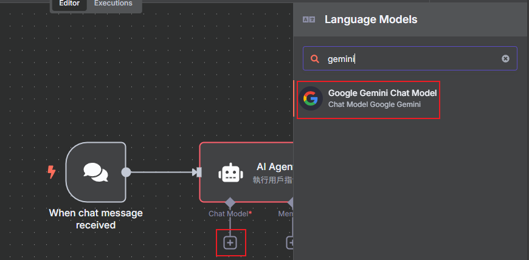
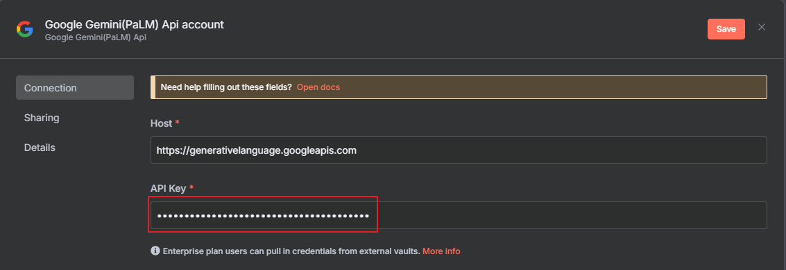
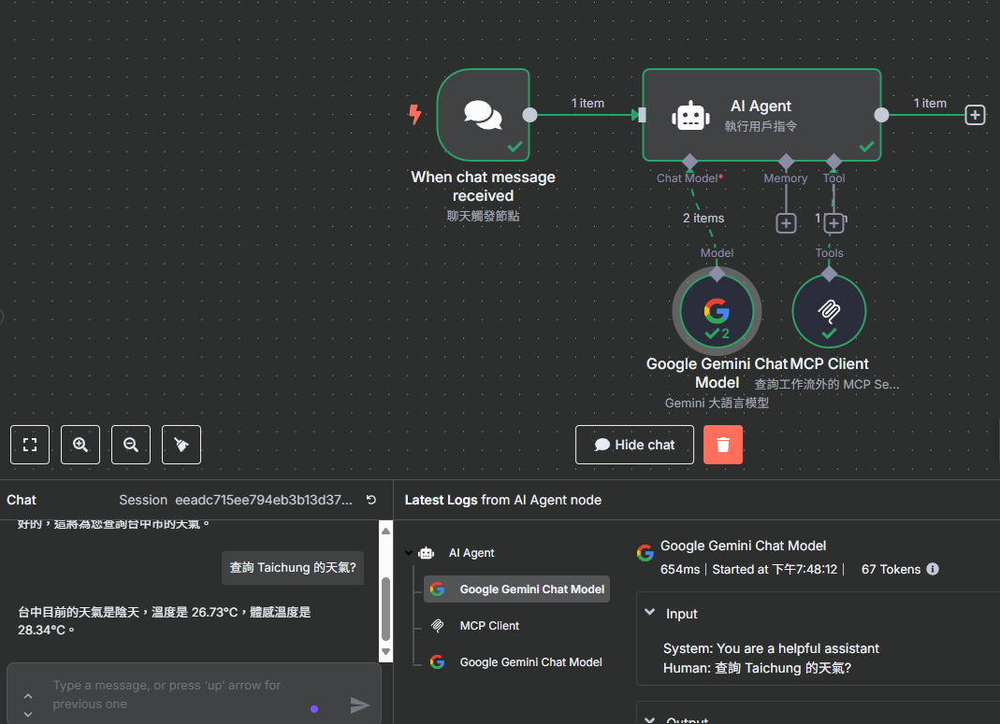

# n8n
全面瞭解 n8n v1.88.0 的重磅更新 —— MCP Server


# 安裝
```shell
npm install n8n -g
```

# 升級
```shell
npm install n8n@latest -g
```

# 執行
```shell
n8n start
```
瀏覽器開啟 http://localhost:5678

# 登入
創建帳號並登入

# 支持 MCP
在 n8n 1.88.0 版本中，允許使用 SSE（Server-Sent Events）技術進行發佈的功能主要與新加入的 MCP（Model Context Protocol）節點相關。
```shell
n8n --version
```

# 建立 MCP Server Trigger

點選右邊介面搜尋 `MCP Server Trigger`  
建立一個 MCP 服務器  

## Tools 新增節點 Calculator

## Tools 新增節點 OpenWeatherMap
去申請 https://openweathermap.org/ 的免費服務  
請去註冊並取得 API 金鑰 (API Key)  


## 新增完上面的兩個節點後
備份 ‵MCP Server Trigger‵ 的 `Production URL`  

# 創建新的工作流
點擊左上角的加號，創建新的工作流  

# 新增 `Chat Trigger`  
## 新增 `AI Agent`
### 新增 `Chat Model`
新增 Gemini 的 AI 大語言模型  

輸入 Gemini 的 API Key  

模型可以選 `models-2.0-flash`
### 新增 Tool `MCP Clinet Tool`
SSE 欄位貼上剛剛備份的 `Production URL`  
PS: 我電腦上 localhost 要改成 127.0.0.1 才能連上  

# 測試

輸入 `查詢 Taichung 的天氣?`
輸入 `8 加 9 等於多少?`


